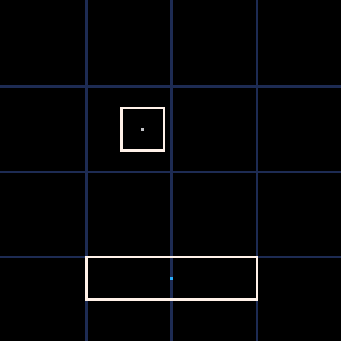

# PICO8 Physics Engine
A rudimentary **2d physics engine** based on constraint resolution with a Gauss Seidel solver, for the **PICO8 Fantasy Console**.

## 🎯 Features

- Static and dynamic bodies
- Ball Joints
- Contact Resolution with broad phase
- Friction

---

## 🛠 Requirements

- [**PICO8**](https://www.lexaloffle.com/pico-8.php) installed  
- Mouse required

---

## 🚀 How to Play

1. Open **Picotron**
2. Load the cart:  
   - Place `phy.p8` in your PICO8 carts directory
3. Launch the cart

---

## 📝 Notes

- In the current state, this is no more than a tech demo, as it suffers from heavy performance/accuracy issues stemming from the limitations of PICO8
- Refer to Erin Catto's brilliant [Box2D](https://github.com/erincatto/box2d) for a more complete and usable implementation. His continued work on this topic has been a big inspiration for this demo.
